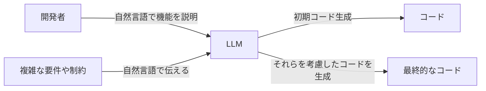
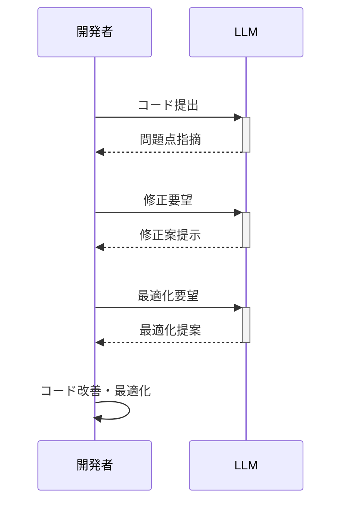
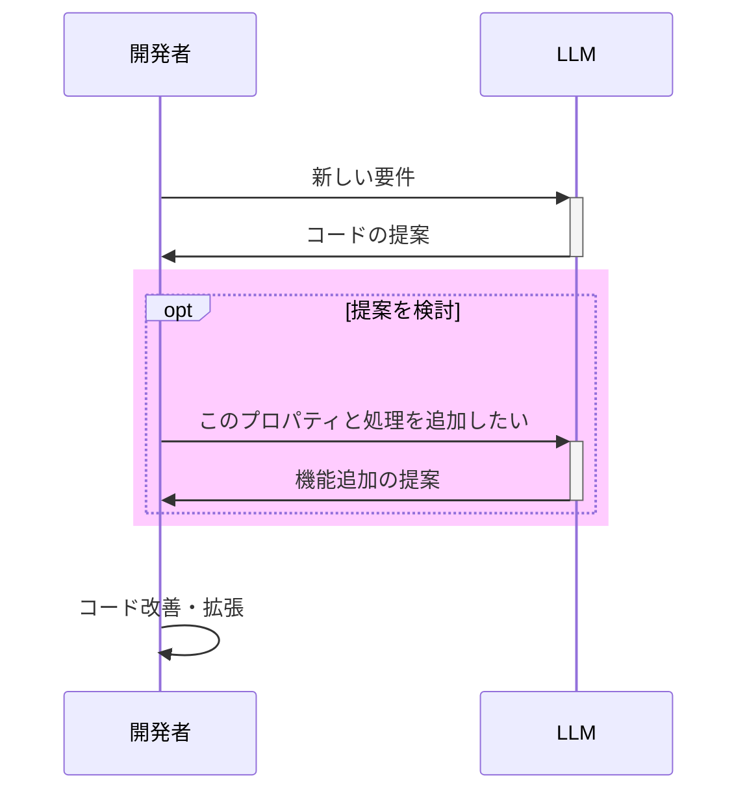
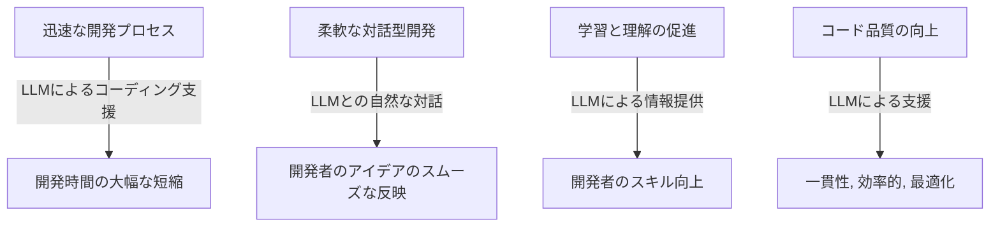
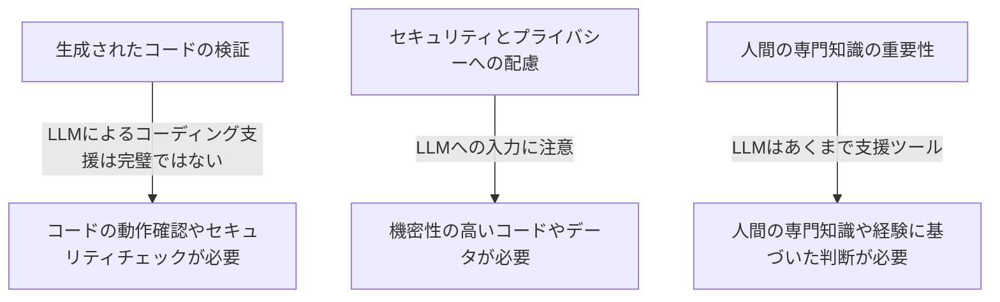
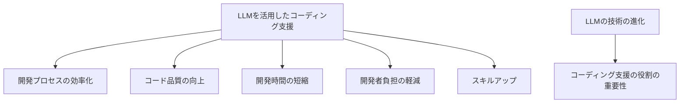

# doc_genai_About_specific_use_cases_for_large-scale_language_models_LLM
大規模言語モデル（LLM）の具体的なユースケースについて

<br/><br/>
## 大規模言語モデル（LLM）の具体的なユースケースについて

<br/><br/>
### 目次
- [1. はじめに](#1-はじめに)
- [2. LLMを活用したコーディング支援のユースケース](#2-llmを活用したコーディング支援のユースケース)
- [3. LLMを活用したコーディング支援の説明](#3-llmを活用したコーディング支援の説明)
- [4. LLMの利点](#4-llmの利点)
- [5. 注意点と制限事項](#5-注意点と制限事項)
- [6. まとめ](#6-まとめ)

<br/><br/>
### 1. はじめに

近年、AI技術の進展により、大規模言語モデル（LLM）が注目されています。LLMは、自然言語処理において高い能力を発揮し、コーディング支援においても革新的な可能性を秘めています。本資料では、LLMを活用したコーディング支援の実用性について、具体的なユースケースを交えながら解説します。

<br/><br/>
### 2. LLMを活用したコーディング支援のユースケース

LLMを活用したコーディング支援のユースケースについて、具体例を示します。
<br/><br/>

<br/>
👨‍💻 **開発者**: えーっと、文字列の前後を空白トリムするという機能を、ある条件を守りながら書きたいと思っております。

🤖 **LLM**: 承知いたしました。それでは、以下のようなコードはいかがでしょうか？

```python
def trim_string(s):
    return s.strip()
```

<br/>
👨‍💻 **開発者**: おおお！なるほどですね…勉強になります。ただ、ここは少し違うようです。

🤖 **LLM**: 承知いたしました。修正すべき箇所を教えていただけますと幸いです。

<br/>
👨‍💻 **開発者**: この部分を、例えば空白だけでなく、タブもトリムするように書き換えていただけますか？

🤖 **LLM**: 承知いたしました、修正いたしました。以下が修正後のコードになります。

```python
def trim_string(s):
    return s.strip(" \t")
```

<br/>
👨‍💻 **開発者**: そうそう、その通りです！！ あ、あれもあったじゃないですか

🤖 **LLM**: 追加すべき機能や処理について教えていただけますと幸いです。

<br/>
👨‍💻 **開発者**: この関数に、文字列がNoneの場合は空文字を返すという処理を追加していただけますか？

🤖 **LLM**: 承知いたしました、追加いたしました。以下が最新版のコードになります。

```python
def trim_string(s):
    if s is None:
        return ""
    return s.strip(" \t")
```

<br/>
👨‍💻 **開発者**: うんうん、なるほど、そういう風に追加してきたのですね。まあ、問題はなさそうです。

🤖 **LLM**: ご満足いただけて、大変嬉しく思います。他に修正や追加のご要望はございますか？

<br/>
👨‍💻 **開発者**: いえ、もう大丈夫です。ありがとうございました！

🤖 **LLM**: こちらこそ、ご協力いただき、誠にありがとうございました。何か他にお手伝いできることがありましたら、お気軽にお申し付けください。 


<br/><br/>
### 3. LLMを活用したコーディング支援の説明

LLMは、コーディングプロセス全体を通して開発者を支援することができます。

<br/><br/>
**1. 迅速な初期コード生成**

開発者は、自然言語でLLMに機能を説明することで、初期コードを迅速に生成できます。例えば、「ユーザーが入力したテキストを反転させる関数を作成してください」といった指示に対して、LLMは適切なコードを提案します。複雑な要件や制約も自然言語で伝えることができ、LLMはそれらを考慮したコードを生成します。



<br/><br/>
**2. コード修正と最適化**

LLMは、既存コードの問題点の指摘や修正案の提示、パフォーマンス改善のための最適化提案を行うことができます。開発者は、LLMとの対話を通じて、コードを段階的に改善し、最適化していくことができます。
例えば、「この部分をこうゆう条件で書き換えたい」という要望に対して、LLMは適切なコード修正を提案します。





<br/><br/>
**3. 機能追加とコード拡張**

LLMは、新しい要件に基づくコードの追加や、既存コードとの整合性を保った拡張を支援します。開発者は、「このプロパティと処理を追加したい」といった指示をLLMに与えることで、容易に機能を追加できます。




<br/><br/>
### 4. LLMの利点

LLMによるコーディング支援には、以下のような利点があります。

* **迅速な開発プロセス:** 初期コードの生成、修正、機能追加を効率化することで、開発時間を大幅に短縮できます。
* **柔軟な対話型開発:**  LLMとの自然な対話を通じて、開発者は自身のアイデアをスムーズにコードに反映できます。
* **学習と理解の促進:** LLMは最新のコーディング手法や設計パターン、ベストプラクティスに関する情報を提供し、開発者のスキル向上を促進します。
* **コード品質の向上:** LLMは一貫性のあるコーディングスタイルの維持、効率的なアルゴリズムの提案、セキュリティやパフォーマンスの最適化を支援し、コード品質の向上に貢献します。




<br/><br/>
### 5. 注意点と制限事項

LLMによるコーディング支援は強力なツールですが、以下の点に注意が必要です。

* **生成されたコードの検証:** LLMが生成したコードは、必ずしも完璧ではありません。開発者は、コードの動作確認やセキュリティチェックなど、必要な検証を行う必要があります。
* **セキュリティとプライバシーへの配慮:** LLMに機密性の高いコードやデータを入力する場合は、セキュリティとプライバシーに十分配慮する必要があります。
* **人間の専門知識の重要性:** LLMはあくまで支援ツールであり、開発者の代わりになるものではありません。人間の専門知識や経験に基づいた判断が依然として重要です。



<br/><br/>
### 6. まとめ

LLMを活用したコーディング支援は、開発プロセスを効率化し、コード品質を向上させるための強力なツールです。開発時間の短縮、開発者負担の軽減、スキルアップなど、多くの利点をもたらします。今後、LLMの技術はさらに進化し、コーディング支援における役割はますます重要になっていくでしょう。




